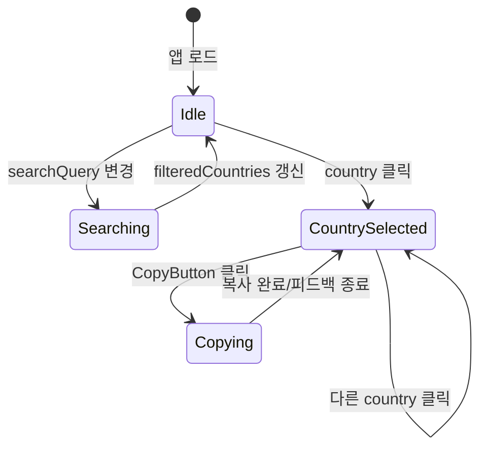

# Global Site Navigator — 아키텍처

PRD(`docs/PRD.md`)를 기준으로 한 **설계 문서**이다. 구현 코드는 포함하지 않는다.

구현 절차: [`WORKFLOW.md`](./WORKFLOW.md) · 규칙: [`RULES.md`](./RULES.md) · 작업: [`TASKS.md`](./TASKS.md) · 테스트: [`TEST_PLAN.md`](./TEST_PLAN.md)

---

## 1. 개요

| 항목        | 내용                                                                                   |
| ----------- | -------------------------------------------------------------------------------------- |
| 앱 유형     | **Next.js 15 App Router** 단일 페이지 앱 (정적 설정 기반, 백엔드 API 없음)             |
| 데이터 소스 | **국가 코드·로케일** + **환경별 메인 도메인** 설정을 조합해 URL 생성 (백엔드 API 없음) |
| 핵심 UX     | 국가 검색(그룹 목록) → 국가 선택 → **DEV → STG → PROD** 순 Site·AEM 링크 표시·복사 (좁은 폭 레이아웃) |

외부 인증·권한은 PRD 범위 밖이며, 내부 도구(개발/QA/운영/PM)용으로 가정한다.

---

## 2. 폴더 구조

물리 경로·스택·배포는 [`RULES.md`](./RULES.md) §1·§5·§5.4가 **정본**이다. 아래는 **역할** 기준 트리다.

```
lgb2b-ro-navigation/
├── docs/
├── public/
├── app/
│   ├── layout.tsx
│   ├── page.tsx
│   └── globals.css
├── src/
│   ├── types/                       # 도메인 타입 (Country, Environment 등)
│   │   └── index.ts
│   │
│   ├── data/                        # 설정 (JSON 또는 TS 모듈)
│   │   ├── countries.ts             # countryGroups + Country[] (groupId 포함)
│   │   ├── urlRules.ts              # 환경별 URL 조합 템플릿 (호스트+경로, 플레이스홀더)
│   │   └── countries.schema.json    # (선택) 설정 검증용 JSON Schema
│   │
│   ├── utils/                       # 순수 함수
│   │   ├── searchCountries.ts
│   │   ├── groupCountries.ts        # 그룹별 목록 분할 (필터 결과 반영)
│   │   ├── buildEnvironmentUrls.ts  # 도메인 + 코드 → 완성 URL
│   │   └── copyToClipboard.ts
│   │
│   ├── hooks/                       # UI·도메인 훅
│   │   ├── useCountrySearch.ts
│   │   ├── useSelectedCountry.ts
│   │   ├── useNcmsConnectivity.ts   # global NCMS 프로브
│   │   └── useFavorites.ts          # (향후) localStorage 연동
│   │
│   ├── store/                       # (선택) 전역 UI 상태 — Zustand 등
│   │   └── navigatorStore.ts
│   │
│   ├── components/
│   │   ├── layout/
│   │   │   ├── AppShell.tsx         # 헤더, 메인 영역 그리드
│   │   │   ├── PageHeader.tsx
│   │   │   └── NcmsStatusBadge.tsx   # 헤더 NCMS 접속 상태 배지
│   │   │
│   │   ├── country/
│   │   │   ├── CountrySearchInput.tsx
│   │   │   ├── CountryList.tsx
│   │   │   ├── CountryListItem.tsx
│   │   │   └── CountryEmptyState.tsx
│   │   │
│   │   ├── environment/
│   │   │   ├── envOrder.ts            # UI 노출 순서: dev → stg → prod
│   │   │   ├── EnvironmentPanel.tsx   # 선택 국가의 3환경 묶음
│   │   │   ├── EnvironmentSection.tsx # DEV | STG | PROD 한 블록
│   │   │   └── LinkRow.tsx            # Site / NCMS / AEM + 복사 (한 줄)
│   │   │
│   │   └── common/
│   │       ├── CopyButton.tsx
│   │       ├── ExternalLink.tsx
│   │       └── Badge.tsx              # 환경 라벨 (PROD/STG/DEV)
├── next.config.ts
├── vitest.config.ts
├── package.json
└── tsconfig.json
```

### 폴더 역할 요약

| 경로              | 책임                                                                                                       |
| ----------------- | ---------------------------------------------------------------------------------------------------------- |
| `app/`            | 라우팅·레이아웃·Container(`page.tsx`, Client 섬)                                                           |
| `src/data/`       | 국가 코드(`countries`)·URL 조합 규칙(`urlRules`)의 **SSoT**. 완성 URL은 저장하지 않고 템플릿 치환으로 생성 |
| `src/types/`      | 설정·UI가 공유하는 타입 계약                                                                               |
| `src/utils/`      | 부수 효과 없는 로직 (테스트 용이)                                                                          |
| `src/hooks/`      | Client 전용 — 검색(debounce)·선택·즐겨찾기 등                                                              |
| `src/components/` | 표시·이벤트만; 비즈니스 규칙은 hooks/utils로 위임                                                          |
| `src/store/`      | 여러 컴포넌트가 공유하는 UI 상태가 커질 때만 도입 (초기에는 hooks만으로 가능)                              |

---

## 3. 데이터 구조

국가별로 **완성 URL을 저장하지 않는다.**  
`Country`는 `countryCode`·`localeCode`만 갖고, **`urlRules.ts`**에 환경별 **URL 템플릿**(호스트+경로+`#` fragment 포함)을 두고 런타임에 치환해 Site·Admin URL을 만든다.

조합 규칙 요약 (확정):

| 구분                             | 사용 토큰       | 경로 패턴                                                                    |
| -------------------------------- | --------------- | ---------------------------------------------------------------------------- |
| **실제 Site**                    | `{localeCode}`  | `lg.com/{localeCode}/business`                                               |
| **개발환경 Site** (dev/stg/prod) | `{localeCode}`  | `ncms-btb-auth.gp1*.aws.lge.com/{localeCode}/business`                       |
| **Admin** (dev/stg/prod)         | `{countryCode}` | `author-*.adobeaemcloud.com/ui#/aem/sites.html/content/lgebtb/{countryCode}` |

### 3.1 설정 데이터 — 분리 구조

```
┌──────────────────────────────────────────────────────────┐
│  urlRules.ts                                              │
│  ├── actual.site     … 실제(운영) Site 템플릿              │
│  ├── site { dev,stg,prod } … NCMS Site 템플릿             │
│  └── admin { dev,stg,prod } … AEM Author 템플릿           │
└────────────────────────────┬─────────────────────────────┘
                             │      ┌──────────────────────┐
                             │  +   │  countries.ts        │
                             │      │  (countryCode,       │
                             │      │   localeCode)        │
                             │      └──────────┬───────────┘
                             │                 │
                             └────────┬────────┘
                                      ▼
                           buildEnvironmentUrls()
                                      ▼
                           ResolvedEnvironmentUrls (파생, §3.4)
```

### 3.2 도메인 모델 (TypeScript 관점)

#### Country — 국가 엔트리 (저장)

```
Country
├── id: string              # 고유 ID (목록·즐겨찾기 키, 예: "gb")
├── name: string            # 표시용 국가명 (예: "United Kingdom")
├── nameAliases?: string[]  # 검색용 별칭 (예: ["UK", "영국"])
├── countryCode: string     # Admin 경로 (예: "gb", "ca")
├── localeCode: string      # 단일 로케일 Site 기본값 (예: "uk")
├── locales?: CountryLocale[]  # 다중 Site·NCMS (예: ca_en, ca_fr)
└── groupId: string

CountryLocale
├── localeCode: string
└── label?: string          # UI 접미 (예: EN)

CountryGroup
├── id: string              # 예: "opened", "group1"
└── label: string           # UI 헤더 (예: "기오픈 국가")
```

- `Country`에는 **prod/stg/dev URL 필드가 없다.**
- `id`와 `countryCode`를 같게 둘 수 있으나, 역할이 다르므로 타입·필드는 분리한다 (`id` = 앱 내부 식별, `countryCode` = URL 규칙 입력).

#### UrlRules — URL 조합 템플릿 (저장)

호스트·경로·fragment(`#`)까지 **한 문자열 템플릿**으로 저장한다. 국가 추가 시 `countries.ts`만 수정한다.

```
UrlRules
├── actual
│   └── site: UrlTemplate       # 실제(운영) Site — locale만 치환
├── site: TierUrlTemplates      # NCMS 개발환경 Site — tier별
│   ├── dev: UrlTemplate
│   ├── stg: UrlTemplate
│   └── prod: UrlTemplate
└── admin: TierUrlTemplates     # AEM Author — tier별, country만 치환
    ├── dev: UrlTemplate
    ├── stg: UrlTemplate
    └── prod: UrlTemplate

UrlTemplate = string            # "https://host/.../{localeCode}/..." 형태
EnvironmentTier = "dev" | "stg" | "prod"
```

**플레이스홀더 (치환 규칙):**

| 토큰            | 출처                  | 사용처                                         |
| --------------- | --------------------- | ---------------------------------------------- |
| `{localeCode}`  | `Country.localeCode`  | **Site** 템플릿 전부 (`actual.site`, `site.*`) |
| `{countryCode}` | `Country.countryCode` | **Admin** 템플릿 전부 (`admin.*`)              |

- Site URL에는 `countryCode`를 넣지 않는다.
- Admin URL에는 `localeCode`를 넣지 않는다.

**확정 템플릿 (`urlRules.ts` — 스킴 `https://` 기본):**

| 키            | 템플릿 (플레이스홀더 포함)                                                                          |
| ------------- | --------------------------------------------------------------------------------------------------- |
| `actual.site` | `https://lg.com/{localeCode}/business`                                                              |
| `site.dev`    | `https://ncms-btb-auth.gp1dev.aws.lge.com/{localeCode}/business`                                    |
| `site.stg`    | `https://ncms-btb-auth.gp1stg.aws.lge.com/{localeCode}/business`                                    |
| `site.prod`   | `https://ncms-btb-auth.gp1.aws.lge.com/{localeCode}/business`                                       |
| `admin.dev`   | `https://author-p155411-e1648827.adobeaemcloud.com/ui#/aem/sites.html/content/lgebtb/{countryCode}` |
| `admin.stg`   | `https://author-p155411-e1648867.adobeaemcloud.com/ui#/aem/sites.html/content/lgebtb/{countryCode}` |
| `admin.prod`  | `https://author-p155411-e1648866.adobeaemcloud.com/ui#/aem/sites.html/content/lgebtb/{countryCode}` |

- Admin 경로의 `#`(hash)는 AEM SPA 라우팅용이므로 **템플릿에 그대로 포함**하고, 복사·새 탭 시 fragment 유지한다.
- `localeCode`·`countryCode` 값은 `countries.ts`에 저장된 문자열을 **그대로** 치환한다 (대소문자·하이픈 정책은 데이터 입력 규칙으로 통일).

#### UI 환경(PROD/STG/DEV) ↔ 템플릿 매핑

| UI 환경 (`EnvironmentKind`) | Site URL 템플릿     | Admin URL 템플릿   |
| --------------------------- | ------------------- | ------------------ |
| `prod`                      | `rules.actual.site` | `rules.admin.prod` |
| `prod` (보조)               | `rules.site.prod`   | —                  |
| `stg`                       | `rules.site.stg`    | `rules.admin.stg`  |
| `dev`                       | `rules.site.dev`    | `rules.admin.dev`  |

- **PROD** UI 섹션: PRD의 “PROD Site”는 **실제 도메인**(`actual.site`). NCMS PROD(`site.prod`)는 동일 섹션에 **보조 Site 링크**로 노출한다 (UI 라벨: **`Site`**, **`NCMS`**; 테스트·문서 풀체크 표기는 `Site (실제)` / `Site (NCMS)` 동일 의미).
- **STG/DEV**: Site는 NCMS 템플릿 1개 + Admin 1개 (Admin UI 라벨: **`AEM`**).

**UI 환경 섹션 노출 순서 (확정):** `dev` → `stg` → `prod` (`src/components/environment/envOrder.ts`의 `ENV_DISPLAY_ORDER`). URL 규칙·`ResolvedEnvironmentUrls` 객체 키 순서와 무관하다.

**시드 데이터** (`countries.ts` — URL 풀체크 정본: `global`·`gb`):

| groupId | 국가 (id) | 비고 |
| ------- | --------- | ---- |
| GROUP1 (`group1`) | global, th, gb(uk), fr, pa, mx, co, tr, pl | 태국~폴란드 + global |
| GROUP2 (`group2`) | ph, za, pe, ma, vn, pt, id, ca | ca: `locales` ca_en, ca_fr |

- `uk`→`gb`: Site `localeCode=uk`, Admin `countryCode=gb`.
- `locales`가 있으면 로케일마다 Site·NCMS, Admin은 `countryCode` 1건.
- `id`는 목록·즐겨찾기 키. 현재 시드에서는 `countryCode`와 동일하게 둔다.
- **확장 시:** `id`와 `countryCode`를 다르게 둘 수 있음(영국: Site `localeCode=uk`, Admin `countryCode=gb`). 신규 국가 추가 시 ARCHITECTURE §3.2 예시 표를 보강한다.
- Site 경로는 `localeCode`, Admin content path는 `countryCode`를 **그대로** 치환한다.

**조합 예시 A — 영국** (`countryCode = "gb"`, `localeCode = "uk"`):

| UI 환경 | 링크        | 결과 URL                                                                                 |
| ------- | ----------- | ---------------------------------------------------------------------------------------- |
| prod    | Site (실제) | `https://lg.com/uk/business`                                                             |
| prod    | Site (NCMS) | `https://ncms-btb-auth.gp1.aws.lge.com/uk/business`                                      |
| prod    | Admin       | `https://author-p155411-e1648866.adobeaemcloud.com/ui#/aem/sites.html/content/lgebtb/gb` |
| stg     | Site        | `https://ncms-btb-auth.gp1stg.aws.lge.com/uk/business`                                   |
| stg     | Admin       | `https://author-p155411-e1648867.adobeaemcloud.com/ui#/aem/sites.html/content/lgebtb/gb` |
| dev     | Site        | `https://ncms-btb-auth.gp1dev.aws.lge.com/uk/business`                                   |
| dev     | Admin       | `https://author-p155411-e1648827.adobeaemcloud.com/ui#/aem/sites.html/content/lgebtb/gb` |

**조합 예시 B — 글로벌** (`countryCode = "global"`, `localeCode = "global"`):

| UI 환경 | 링크        | 결과 URL                                                                                     |
| ------- | ----------- | -------------------------------------------------------------------------------------------- |
| prod    | Site (실제) | `https://lg.com/global/business`                                                             |
| prod    | Site (NCMS) | `https://ncms-btb-auth.gp1.aws.lge.com/global/business`                                      |
| prod    | Admin       | `https://author-p155411-e1648866.adobeaemcloud.com/ui#/aem/sites.html/content/lgebtb/global` |
| stg     | Site        | `https://ncms-btb-auth.gp1stg.aws.lge.com/global/business`                                   |
| stg     | Admin       | `https://author-p155411-e1648867.adobeaemcloud.com/ui#/aem/sites.html/content/lgebtb/global` |
| dev     | Site        | `https://ncms-btb-auth.gp1dev.aws.lge.com/global/business`                                   |
| dev     | Admin       | `https://author-p155411-e1648827.adobeaemcloud.com/ui#/aem/sites.html/content/lgebtb/global` |

```
완성 URL = applyTemplate(template, country)
         = template
             .replace("{localeCode}", country.localeCode)
             .replace("{countryCode}", country.countryCode)
         → normalize()   // 인코딩·중복 슬래시 등 (필요 시)
```

#### 파생 타입 — UI·복사용 (저장하지 않음)

```
ResolvedEnvironmentUrls
├── prod: EnvironmentLinks
├── stg: EnvironmentLinks
└── dev: EnvironmentLinks

EnvironmentLinks
├── sites: ResolvedSiteLocale[]  # 로케일별 site·siteNcms?(prod)
└── admin: string                  # Admin 1건 (countryCode)

EnvironmentKind = "prod" | "stg" | "dev"
LinkKind = "site" | "admin"
```

### 3.3 설정 파일 책임

| 파일           | export      | 필수 필드                                                                  |
| -------------- | ----------- | -------------------------------------------------------------------------- |
| `countries.ts` | `countryGroups`, `Country[]` | `CountryGroup`: `id`, `label`; `Country`: `id`, `name`, `countryCode`, `localeCode`, `groupId` |
| `urlRules.ts`  | `UrlRules`  | `actual.site`, `site.{dev,stg,prod}`, `admin.{dev,stg,prod}` 템플릿 문자열 |

| Country 필드  | 필수 | 설명                                    |
| ------------- | ---- | --------------------------------------- |
| `id`          | O    | 목록 key, 즐겨찾기 저장 키              |
| `name`        | O    | 기본 표시명                             |
| `nameAliases` | X    | 검색 확장                               |
| `countryCode` | O    | URL 조합 입력 (도메인에 직접 넣지 않음) |
| `localeCode`  | O    | URL 조합 입력                           |
| `groupId`     | O    | `countryGroups` 중 하나 — 목록 섹션     |

| UrlRules 필드 | 필수 | 설명                                                    |
| ------------- | ---- | ------------------------------------------------------- |
| `actual.site` | O    | 실제(운영) Site 템플릿 — `lg.com/{localeCode}/business` |
| `site.dev`    | O    | NCMS DEV Site 템플릿                                    |
| `site.stg`    | O    | NCMS STG Site 템플릿                                    |
| `site.prod`   | O    | NCMS PROD Site 템플릿 — PROD UI 보조 Site 링크          |
| `admin.dev`   | O    | AEM Author DEV — `{countryCode}` 경로                   |
| `admin.stg`   | O    | AEM Author STG                                          |
| `admin.prod`  | O    | AEM Author PROD                                         |

완성 URL은 설정 파일에 **쓰지 않는다.** 클립보드·새 탭용 절대 URL은 항상 `buildEnvironmentUrls` 출력을 사용한다.

### 3.4 파생(뷰) 데이터 — 저장하지 않음

| 파생 데이터          | 입력                             | 용도                                   |
| -------------------- | -------------------------------- | -------------------------------------- |
| `filteredCountries`  | `countries`, `searchQuery`       | 국가 목록 렌더                         |
| `groupedSections`    | `countryGroups`, `filtered`      | `groupCountries` — 그룹 헤더 + 항목    |
| `selectedCountry`    | `countries`, `selectedCountryId` | 선택 국가                              |
| `resolvedUrls`       | `selectedCountry`, `urlRules`    | `ResolvedEnvironmentUrls` — 패널·복사  |
| `environmentRows`    | `resolvedUrls`                   | PROD/STG/DEV × (site, admin) 플랫 목록 |
| `favoriteCountryIds` | localStorage (향후)              | 목록 상단·필터                         |

`resolvedUrls`는 `useMemo`로 캐시한다. `urlRules`는 정적 import이므로 **선택 국가가 바뀔 때만** 재계산하면 된다.

### 3.5 URL 빌드 유틸 (`buildEnvironmentUrls`)

```
applyTemplate(template: UrlTemplate, country: Country): string

resolveTemplate(
  kind: EnvironmentKind,
  link: LinkKind,
  rules: UrlRules
): UrlTemplate

buildEnvironmentUrls(country: Country, rules: UrlRules): ResolvedEnvironmentUrls
```

`resolveTemplate` 규칙 (§3.2 매핑 표):

| `kind` | `link`  | 템플릿              |
| ------ | ------- | ------------------- |
| `prod` | `site`  | `rules.actual.site` |
| `prod` | `admin` | `rules.admin.prod`  |
| `stg`  | `site`  | `rules.site.stg`    |
| `stg`  | `admin` | `rules.admin.stg`   |
| `dev`  | `site`  | `rules.site.dev`    |
| `dev`  | `admin` | `rules.admin.dev`   |

추가:

- `kind === "prod"`일 때 `siteNcms = applyTemplate(rules.site.prod, country)` → `EnvironmentLinks.siteNcms`
- 그 외 tier: `siteNcms` 없음

- 단위 테스트: §3.2 확정 템플릿 6+1케이스, `{localeCode}`/`{countryCode}` 치환, Admin `#` fragment 보존, 미치환 placeholder 방어.

구현·운영 시 합의·확인 항목:

1. `localeCode`·`countryCode`는 **AEM content path·NCMS 경로와 동일 표기** (변환 로직 금지). 영국은 Site `uk` / Admin `gb` 분리.
2. `applyTemplate` 시 경로 세그먼트는 **인코딩 없이** 데이터 문자열 그대로 사용.
3. `lg.com`에 **www** 서브도메인 필요 여부 (현재 확정: `https://lg.com/...`)
4. `countries.ts`만 변경한 PR은 **`next build` 후 배포**해야 URL이 반영된다 (RULES §5.4).

### 3.6 검색 규칙

- 대상: `name` + `nameAliases` (있을 경우)
- 방식: 대소문자 무시 **부분 문자열** 매칭 (초기); 필요 시 초성/다국어는 후속 개선
- **입력 정규화:** `searchCountries` 호출 전 검색어를 **`trim()`** 한다. trim 결과가 빈 문자열이면 **전체 목록**과 동일하게 처리한다.
- **debounce:** trim된 검색어 기준, 입력 후 **300ms** 지난 뒤 `searchCountries` 실행 (RULES §7)
- 빈 검색어(trim 후 `""`): 전체 목록 (또는 즐겨찾기 우선 정렬 — 향후)
- **선택 유지:** 필터 결과에 선택 국가가 없어도 `selectedCountryId`·우측 패널 유지; UI 안내 문구는 한국어 (RULES §7, TEST_PLAN TC-SRH-005)

### 3.7 향후: 즐겨찾기 저장 구조

```
localStorage key: "gsn:favorites:v1"
value: string[]   // Country.id 배열, 사용자 정렬 순서 유지
```

설정(`countries.ts`)과 분리하여 **사용자별 상태**만 브라우저에 둔다.

---

## 4. 컴포넌트 구조

### 4.1 컴포넌트 트리

```
app/page (+ NavigatorClient 등 Client 섬)
└── AppShell
    ├── PageHeader                    # 앱 제목 + NcmsStatusBadge (global NCMS 프로브)
    └── main (2-column 또는 stacked)
        ├── aside / left column
        │   ├── CountrySearchInput
        │   └── CountryList
        │       ├── group header × G   # CountryGroup.label
        │       └── CountryListItem × N
        └── section / right column
            ├── CountryEmptyState     # 미선택 시
            └── EnvironmentPanel      # 선택 시
                └── EnvironmentSection × 3 (**dev → stg → prod**)
                    └── LinkRow × N
                        ├── prod: Site + NCMS + AEM
                        ├── stg/dev: Site + AEM
                        └── CopyButton
```

### 4.2 컴포넌트 책임

| 컴포넌트             | Props (개념)                           | 책임                                                                   |
| -------------------- | -------------------------------------- | ---------------------------------------------------------------------- |
| `AppShell`           | `children`                             | 레이아웃, 반응형 breakpoint                                            |
| `CountrySearchInput` | `value`, `onChange`                    | 검색어 입력; 필터는 **300ms debounce** 후 적용 (RULES §7)              |
| `CountryList`        | `countries`, `selectedId`, `onSelect`  | 그룹 헤더 + 스크롤 목록; 키보드는 **flat** 순서(그룹 경계 무시)        |
| `CountryListItem`    | `country`, `isSelected`, `isFavorite?` | 국가명 + `countryCode`; 클릭 선택                                      |
| `CountryEmptyState`  | —                                      | "국가를 선택하세요" 안내                                               |
| `EnvironmentPanel`   | `country`, `resolvedUrls`              | 국가명 + `countryCode`·`localeCode` 메타 + `ENV_DISPLAY_ORDER` 섹션    |
| `EnvironmentSection` | `kind`, `links`                        | 환경 카드(제목+Badge) + LinkRow; ncms 호스트 → **NCMS** 라벨 (`linkRowLabel`) |
| `LinkRow`            | `label`, `url`                         | 한 줄(라벨·축약 URL·복사); 복사·새 탭은 **전체 URL**·hash 포함         |
| `CopyButton`         | `text`, `onSuccess?`                   | 클립보드 API, 성공 토스트/체크 아이콘                                  |

### 4.3 데이터 흐름 (단방향)

```
countries.ts + urlRules.ts (정적)
       ↓
useCountrySearch → filteredCountries → CountryList
       ↓
useSelectedCountry → selectedCountry
       ↓
buildEnvironmentUrls(selectedCountry, urlRules) → resolvedUrls
       ↓
EnvironmentPanel(resolvedUrls) → LinkRow
       ↓
copyToClipboard ← CopyButton
```

- **설정 데이터는 props로만 내려보냄** (컴포넌트가 `data/` 직접 import하지 않도록 하면 테스트·스토리북에 유리; 소규모 앱에서는 페이지/컨테이너 1곳에서 import 후 props 전달도 허용)

### 4.4 컨테이너 vs 프레젠테이션 (권장)

| 레이어         | 예시                                                   | 역할                                    |
| -------------- | ------------------------------------------------------ | --------------------------------------- |
| Container      | `app/page.tsx`, `NavigatorClient.tsx` (`'use client'`) | `data/` import, hooks, `resolvedUrls`   |
| Presentational | `src/components/**`                                    | props만, `data/` import 금지 (RULES §7) |

MVP는 `app/page.tsx` + Client 섬 1개로 충분하다.

### 4.5 접근성·UX (설계 수준)

- 목록: `role="listbox"`, 항목 `aria-selected`
- 복사 성공: `aria-live="polite"` 영역에 "복사됨" 안내
- 외부 링크: `rel="noopener noreferrer"`, `target="_blank"`

### 4.6 좁은 레이아웃 (폭 제한)

**가로 점유만** 줄인다. 타이포·패딩·간격은 T-030(MVP) 컴포넌트 기본값(`text-sm`/`text-base`, `p-4` 등)을 유지한다. 토큰: `app/globals.css` + `.gsn-app`.

| 토큰 / 구조 | 값 (요약) |
| ----------- | --------- |
| `--width-gsn-app` | `60rem` — 앱 최대 폭, 중앙 정렬 |
| `--width-gsn-sidebar` | `18rem` — md 이상 좌측 국가 패널 |
| `AppShell` | **단일 카드** (`rounded-xl`, `border`, `shadow-md`); 내부는 헤더·좌/우 `border-r`/`border-b`로 분리 |
| `LinkRow` | URL 표시 축약 최대 ~48자 (`...`) — 복사는 전체 URL |

모바일: 세로 스택. `overflow-x: hidden` 유지.

---

## 5. 상태 관리 전략

### 5.1 원칙

| 원칙                     | 설명                                                           |
| ------------------------ | -------------------------------------------------------------- |
| 설정은 상태가 아님       | `Country[]`, `UrlRules`는 정적 import, React state에 넣지 않음 |
| UI 상태는 최소화         | 검색어, 선택 국가 ID, (향후) 즐겨찾기 ID 목록                  |
| 파생 상태는 메모이제이션 | `filteredCountries`는 `useMemo`로 계산                         |
| 서버 상태 없음           | React Query 등 불필요                                          |

### 5.2 상태 분류

| 상태                | 저장 위치                            | 초기값                | 갱신 시점                                       |
| ------------------- | ------------------------------------ | --------------------- | ----------------------------------------------- |
| `searchQuery`       | `useState` (또는 store)              | `""`                  | 검색 입력                                       |
| `selectedCountryId` | `useState` (또는 store)              | **`null`** (MVP 고정) | 목록 클릭; 검색 필터 후에도 **유지** (RULES §7) |
| `copyFeedback`      | `useState` (링크별) 또는 토스트 전역 | —                     | 복사 성공 후 2초 초기화                         |
| `favoriteIds`       | `localStorage` + `useState` (향후)   | `[]`                  | 즐겨찾기 토글                                   |

**선택 국가 정책 (MVP):** 초기 로드 시 **미선택**(`null`, TEST_PLAN TC-SEL-001). 검색으로 목록이 줄어들어도 `selectedCountryId`는 유지한다. 필터에 선택 국가가 없으면 `EnvironmentPanel`은 계속 표시하고, 패널 상단 한국어 안내는 **권장**(TEST_PLAN TC-SRH-005).

### 5.3 단계별 전략

#### Phase 1 (MVP — PRD 현재 범위)

```
useCountrySearch(searchQuery, countries) → filteredCountries
useSelectedCountry(selectedCountryId, countries) → selectedCountry
useMemo → buildEnvironmentUrls(selectedCountry, urlRules) → resolvedUrls
```

- **전역 store 없이** `App` 또는 `NavigatorPage`에서 `useState` 2개로 충분
- `CopyButton`은 로컬 UI 피드백만 `useState`로 처리

#### Phase 2 (즐겨찾기)

```
useFavorites()
  - read/write localStorage
  - favoriteIds, toggleFavorite(id)
  - CountryList 정렬: favoriteIds 순 → 나머지 name 정렬
```

- 여전히 API 없음; `useFavorites` + 기존 hooks 조합
- 컴포넌트 트리 변경 최소: `CountryListItem`에 star 버튼 추가

#### Phase 3 (상태가 복잡해질 때만)

다음 조건 **2개 이상** 해당 시 `Zustand` 등 경량 store 도입 검토:

- URL 쿼리와 선택 국가 동기화 (`?country=kr`)
- 즐겨찾기 + 최근 방문 + 검색어 동시 유지
- 여러 페이지/탭 간 상태 공유

초기에는 **Zustand 단일 slice** 예시:

```
navigatorStore
  - searchQuery
  - selectedCountryId
  - favoriteIds
  - actions: setSearch, selectCountry, toggleFavorite
```

### 5.4 상태 다이어그램 (MVP)



### 5.5 테스트 관점

| 대상                                     | 방식                                                   |
| ---------------------------------------- | ------------------------------------------------------ |
| `searchCountries`                        | 단위 테스트 (순수 함수)                                |
| `applyTemplate` / `buildEnvironmentUrls` | 확정 템플릿 치환, PROD `siteNcms`, Admin fragment      |
| `copyToClipboard`                        | mock `navigator.clipboard`                             |
| 컴포넌트                                 | RTL — 검색 후 목록 개수, 선택 시 EnvironmentPanel 표시 |
| hooks                                    | `@testing-library/react` + `renderHook`                |

---

## 6. 비기능 요구 (설계 메모)

| 항목      | 방향                                                                                      |
| --------- | ----------------------------------------------------------------------------------------- |
| 배포      | **Node 서버** — `next build` + `next start` (Vercel/내부 Node 등, RULES §5.4)             |
| 설정 변경 | `countries.ts` / `urlRules.ts` PR → 배포 (호스트·AEM 인스턴스 변경은 전 국가에 일괄 반영) |
| 보안      | 외부 URL만 링크; `javascript:` 등 스킴 검증은 설정 리뷰로 통제                            |
| 성능      | 국가 수십~백 단위면 가상 스크롤 불필요; 수천 이상 시 `CountryList` 가상화 검토            |

---

## 7. PRD ↔ 설계 매핑

| PRD 기능        | 설계 요소                                               |
| --------------- | ------------------------------------------------------- |
| 국가 선택       | `CountryList` + `selectedCountryId`                     |
| 환경 정보 조회  | `EnvironmentPanel` / `EnvironmentSection`               |
| Site·Admin 링크 | `buildEnvironmentUrls` → `EnvironmentLinks` + `LinkRow` |
| 링크 복사       | `CopyButton` + `copyToClipboard`                        |
| 국가명 검색     | `useCountrySearch` + `searchCountries`                  |
| 즐겨찾기 (향후) | `useFavorites` + localStorage + `CountryListItem`       |

---

## 8. 구현 순서 제안 (참고)

1. `types` + `urlRules`(§3.2 확정 템플릿) + `countries` MVP 시드 2건(`global`, `gb`)
2. `utils/buildEnvironmentUrls` (조합 규칙 단위 테스트)
3. `utils/searchCountries`, `utils/copyToClipboard`
4. `EnvironmentPanel` / `LinkRow` (`resolvedUrls`로 검증)
5. `CountrySearch` + `CountryList` + 선택 상태 연동
6. 레이아웃·접근성·복사 피드백
7. (향후) `useFavorites`

도메인 계약(§3~§5)은 안정적으로 유지하고, 스택·경로 변경은 [`RULES.md`](./RULES.md)와 본 문서 §2·§4를 함께 갱신한다.
