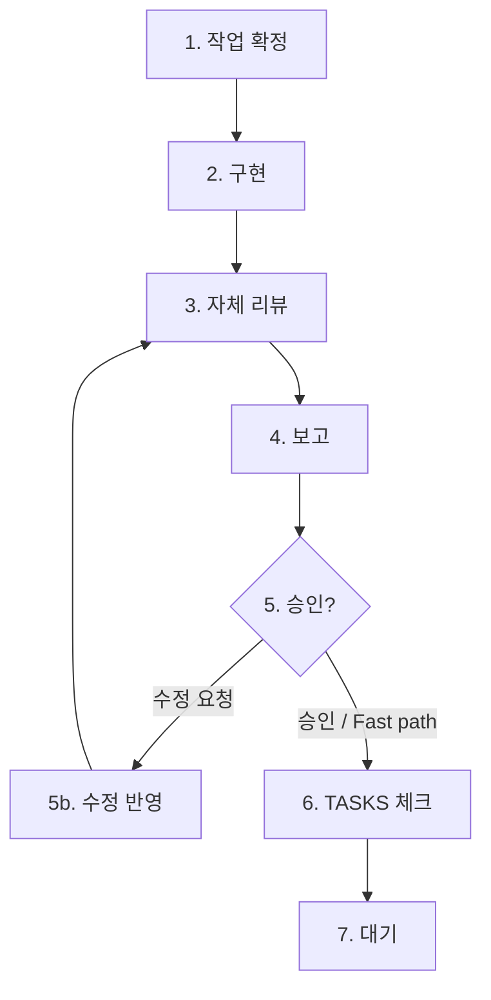

# Global Site Navigator — 구현 워크플로 (WORKFLOW)

## 목적

**Cursor(에이전트)**가 구현할 때 따르는 **수행 순서·승인 게이트**이다.  
코드·설계 정본: [`RULES.md`](./RULES.md), [`ARCHITECTURE.md`](./ARCHITECTURE.md), [`TASKS.md`](./TASKS.md).

**적용:** 사용자가 구현·TASKS 작업을 요청할 때 **본 문서를 먼저** 따른다.

---

## 관련 문서

| 문서                                   | 역할                      |
| -------------------------------------- | ------------------------- |
| [`PRD.md`](./PRD.md)                   | 제품 범위                 |
| [`RULES.md`](./RULES.md)               | 스택·코딩·테스트          |
| [`TASKS.md`](./TASKS.md)               | 작업 ID·완료 기준·`- [x]` |
| [`ARCHITECTURE.md`](./ARCHITECTURE.md) | URL·컴포넌트 계약         |
| [`TEST_PLAN.md`](./TEST_PLAN.md)       | T-039 수동 QA             |

**충돌:** 절차 → **본 문서**. 기술·범위 → RULES / TASKS / ARCHITECTURE.

---

## 핵심 원칙

1. **한 번에 TASKS 1건**만 구현한다.
2. **승인 전** `- [x]` · 다음 ID · commit/push **금지**.
3. **승인·Fast path 후** 에이전트가 체크 반영.
4. 기본 **다음 ID 자동 시작 금지** — 「계속해」「다음 T-xxx」로 **1건**만 예외.

---

## 7단계

| #   | 단계         |
| --- | ------------ |
| 1   | 작업 확정    |
| 2   | 범위 내 구현 |
| 3   | 자체 리뷰    |
| 4   | 보고 (티어)  |
| 5   | 승인·수정    |
| 6   | TASKS 체크   |
| 7   | 대기         |

---

### 1. 작업 확정

- `- [ ]` 중 Phase상 **앞선 1건** (체크박스 = 진행 정본).
- 범위 지시 시 → §「일괄 승인」.
- **한 줄 보고:** `현재: T-xxx — 제목` / 선행: OK|보류

### 2. 범위 내 구현

- 해당 ID의 작업·완료 기준만.

### 3. 자체 리뷰

| 시점              | build | lint | test                           |
| ----------------- | ----- | ---- | ------------------------------ |
| T-000-1 전        | —     | —    | —                              |
| T-000-1 ~ T-000-2 | ○     | —    | —                              |
| T-000-3 ~ T-032   | ○     | ○    | — (**CI test는 T-033부터**)    |
| T-033 이후        | ○     | ○    | ○ (해당 작업이 테스트 요구 시) |

### 4. 보고 티어

| 티어  | TASK ID (대표)                                      |
| ----- | --------------------------------------------------- |
| **S** | T-001~003, T-011~022, T-010, RULES §2.2 예외        |
| **M** | T-004~009, T-023~025, T-027, T-029~031, T-033~038   |
| **L** | T-026, T-028, T-039, Phase 마지막 ID, **일괄 승인** |

| 티어 | 형식                                |
| ---- | ----------------------------------- |
| S    | 5줄 이내 요약 + Pass/Fail           |
| M    | S + 완료 기준 표                    |
| L    | 풀 템플릿(요약·기준·문제·확인 체크) |

**Fast path:** 「승인」「완료 처리」= 4단계 후 승인. 「체크해」「리뷰 생략」= **이상 없을 때만** 4단계 생략 → 6단계. **Fail/Major 시 Fast path 불가.**

### 5. 승인·수정

- 수정 요청 → 범위만 고침 → 3(→4 경량) → 재승인.

### 6. TASKS 체크

- **단건 승인:** 해당 ID만 `- [x]`.
- **일괄 승인:** 범위 내 ID **일괄** `- [x]` (§일괄).

### 7. 대기

- 다음 ID **시작 안 함**. 「다음 T-yyy」**1건** 예외.

---

## 일괄 승인

1. 범위 내 ID를 **순서대로** 2~3만 수행 (중간 ID는 **`- [ ]` 유지가 정상** — 코드만 완료된 상태).
2. **범위 마지막**에서 M/L 보고 1회.
3. 승인 1회로 범위 내 **전부** 체크.
4. 7단계 대기.

---

## 특수 케이스

| 케이스    | 처리                          |
| --------- | ----------------------------- |
| T-039     | TEST_PLAN §11·§12, L 티어     |
| T-006     | **MVP 필수 아님** — 지시 시만 |
| Phase F   | MVP 후                        |
| 선행 미완 | 2단계 보류                    |

---

## 변경 이력

| 날짜       | 내용                                              |
| ---------- | ------------------------------------------------- |
| 2026-06-04 | 최초 작성                                         |
| 2026-06-04 | 개정 — 티어·Fast path·일괄·예외                   |
| 2026-06-04 | CI test 시점(T-033), 티어 ID 표, 일괄 미체크 안내 |
